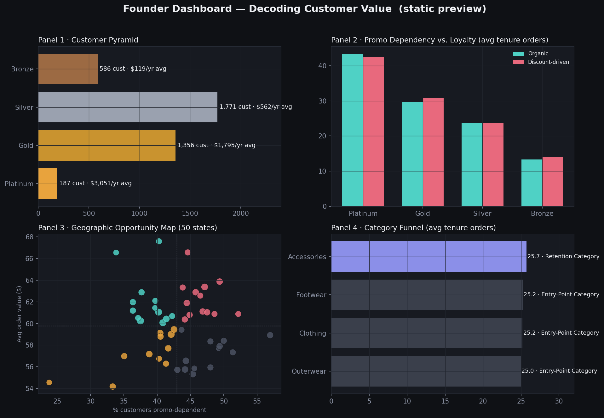

# Decoding Customer Value
### A SQL-driven retention strategy for a D2C fashion brand


> **The brand has data but no intelligence built on top of it.** This project turns 3,900 anonymized customer records into a segmentation model, a queryable analytics layer, interactive dashboards, and board-ready recommendations — with every number traceable back to a query you can re-run.

---

## Live Dashboard

### 📊 Power BI Executive Dashboard

**[Open the Live Power BI Dashboard →](https://app.powerbi.com/links/tt4MY00am1?ctid=38f62926-7559-4aef-84ae-cb5e172406fb&pbi_source=linkShare)**

The Power BI report provides the executive-facing view of the same customer-value analytics used throughout this project.

**Dashboard pages:**

1. **Executive Customer Value** — KPI scorecard, customer pyramid, value distribution, tenure and promo dependency.
2. **Promo Economics** — organic vs. discount-driven value, dependency, tenure and promotional reduction candidates.
3. **Geographic Opportunity** — state-level spend, promo reliance, customer concentration and opportunity classification.
4. **Category & Customer Profile** — entry-point vs. retention categories and the demographic/behavioral profile of high-value customers.

> **Note:** The supplied Power BI URL is a Power BI share link. If a public `Publish to web` URL is required for unauthenticated recruiter access, publish the report through Power BI Service and replace this link with the generated `https://app.powerbi.com/view?r=...` URL.

### Existing interactive dashboard

The repository also contains a fully working browser-based Founder Dashboard using the same engineered customer data:

**[Open the interactive Founder Dashboard](dashboard/founder_dashboard.html)**

It requires no server or build step when opened locally.

---

## The problem

A direct-to-consumer fashion brand — clothing, footwear, accessories, outerwear, no physical stores, no third-party retail — has grown to ~3,900 customers on the strength of a promotional discount program. It has never built a structured way to understand its customers beyond surface-level sales totals, and it can't currently answer:

- Who is genuinely loyal, versus who only buys when there's a discount?
- What behavioral patterns today predict high customer value over time?
- Which geographies and demographics are commercially underleveraged?
- How should the brand restructure its promo strategy to protect margin without losing volume?
- What does the brand's ideal customer actually look like?

This repository is the full answer path: raw data → engineered features → SQL analysis → interactive dashboards → retention playbook.

## What this repo answers

| # | Business question | Where it's answered |
|---|---|---|
| 1 | Loyal vs. discount-driven customers | `sql/02_loyalty_vs_promo_dependency.sql` |
| 2 | Behavioral predictors of long-term value | `python/feature_engineering.py` (`customer_value_score`) |
| 3 | Underleveraged geographies/demographics | `sql/04_geographic_opportunity.sql` |
| 4 | Promo strategy restructuring | `docs/RETENTION_PLAYBOOK.md` §1 |
| 5 | Ideal customer profile & acquisition | `docs/RETENTION_PLAYBOOK.md` §2 |

## Dashboard design

The Power BI implementation is designed as a four-page executive analytics product with cross-filtering through customer, category, geography, season, subscription and value-tier dimensions. Customer-level drill-through is specified for `Customer ID`, purchase behavior, annualized value, value score and promotion flags.

Implementation assets:

- `powerbi/CustomerValue_DAX.dax` — semantic measures
- `powerbi/customer_value_theme.json` — executive visual theme
- `powerbi/README.md` — page-by-page build and publishing specification

## Dashboard preview

The browser-based Founder Dashboard is powered by `dashboard/dashboard_data.json` and contains four analytical panels: Customer Pyramid, Promo Dependency vs. Retention, Geographic Opportunity, and Category Funnel.



## Headline findings

- **43.0%** of the customer base is promo-dependent, but promo dependency **does not correlate with tenure** — organic and discount-driven customers show nearly identical average order counts in every value tier.
- The top 4.8% of customers (**Platinum tier**, 187 people) drive an estimated **$3,051/year** in annualized value each — 25.6x the Bronze tier — and are disproportionately not discount-dependent.
- **Accessories** is the brand's only true retention category; Clothing, Footwear, and Outerwear skew toward first-time and low-tenure buyers.
- 13 states show **Organic High-Traction** patterns — above-average spend with below-average promo reliance — signaling real brand pull.
- Two segments (all of Platinum, plus Gold-tier Accessories buyers — ~620 customers) clear the evidence bar to safely reduce discount dependency; see the [Retention Playbook](docs/RETENTION_PLAYBOOK.md) for the phased plan and explicitly stated risk.

## Repository structure

```text
.
├── data/
│   ├── customer_data_raw.csv
│   └── customer_features.csv
├── python/
│   └── feature_engineering.py
├── sql/
│   ├── 00_schema.sql
│   ├── 01_customer_pyramid.sql
│   ├── 02_loyalty_vs_promo_dependency.sql
│   ├── 03_seasonal_category_tenure.sql
│   ├── 04_geographic_opportunity.sql
│   ├── 05_ideal_customer_profile.sql
│   └── 06_promotional_sunset_candidates.sql
├── dashboard/
│   ├── founder_dashboard.html
│   └── dashboard_data.json
├── powerbi/
│   ├── CustomerValue_DAX.dax
│   ├── customer_value_theme.json
│   └── README.md
├── reports/
│   └── figures/dashboard_preview.png
├── docs/
│   └── RETENTION_PLAYBOOK.md
├── run_pipeline.sh
├── requirements.txt
└── LICENSE
```

## How the pipeline fits together

```text
 data/customer_data_raw.csv
          │
          ▼
 python/feature_engineering.py
          │
          ▼
 data/customer_features.csv ──────────────┐
          │                                │
          ▼                                ▼
 SQLite (data/retention.db)        dashboard/dashboard_data.json
          │                                │
          ▼                                ▼
   sql/*.sql                    Founder Dashboard / Power BI model
          │                                │
          └───────────────┬────────────────┘
                           ▼
              docs/RETENTION_PLAYBOOK.md
```

Every analytical output is traceable to the engineered customer table and the SQL analysis layer.

## Quickstart

```bash
git clone https://github.com/Medix1075/decoding-customer-value.git
cd decoding-customer-value
pip install -r requirements.txt
./run_pipeline.sh
```

Then:

- Open `dashboard/founder_dashboard.html` for the interactive browser dashboard.
- Use `data/customer_features.csv` as the Power BI source.
- Import the measures from `powerbi/CustomerValue_DAX.dax`.
- Apply `powerbi/customer_value_theme.json`.
- Follow `powerbi/README.md` to publish the report.

## The feature engineering layer

The raw dataset is a **customer-level snapshot** (one row per customer, with a `Previous Purchases` counter), not a full transaction log — so classic RFM cannot be computed directly. Every feature is a deliberate proxy chosen because it feeds a downstream decision.

| Feature | What it captures | Decision it feeds |
|---|---|---|
| `est_annual_value` | Order value annualized by stated purchase cadence | Comparable spend across customers |
| `lifetime_value_proxy` | Order value × (previous purchases + 1) | Cumulative value ranking |
| `promo_dependency_score` (0–3) | Discount + promo code + subscription flags | Who is dependent on discounting |
| `is_organic_high_value` | Above-median spend, zero discount/promo usage | Proof of real brand pull |
| `customer_value_score` (0–100) | Weighted percentile blend of spend, tenure, satisfaction | Customer Pyramid tiers |
| `category_role` | Whether a category's buyers skew high- or low-tenure | Entry-point vs. retention categories |

## The SQL analysis layer

Six `.sql` files map to the project's core business questions and dashboard panels. Queries are portable ANSI/PostgreSQL SQL and were validated against the local SQLite pipeline.

## The Founder Dashboard

`dashboard/founder_dashboard.html` is a single-file interactive dashboard with four panels matching the analytical brief. It is retained as the code-reviewable, zero-dependency alternative to the binary Power BI artifact.

## The Power BI Dashboard

The Power BI version is the executive-facing presentation layer over the same customer-value analytics. It adds reusable DAX measures, report-level slicers, drill-through, cross-filtering and an executive visual theme.

**Build assets:** [`powerbi/`](powerbi/)

## The retention playbook

**[→ docs/RETENTION_PLAYBOOK.md](docs/RETENTION_PLAYBOOK.md)**

Two recommendations, each stating the segment, trigger behavior, phased rollout timeline, tracking metric, and risk:

1. **Promotional Sunset Plan** — which ~620 customers to gradually stop discounting, the 12-week phased test, and estimated margin impact.
2. **Ideal Customer Profile** — a data-backed description of the brand's most valuable customer type.

## Known limitations

- No transaction-level timestamps exist in the source data, so tenure and value metrics are proxies built from `Previous Purchases` and stated purchase cadence.
- Margin estimates use an assumed average discount rate; replace with real category-level gross margins before external use.
- Category role is computed at whole-base level and does not model cross-category purchase sequencing.
- The supplied Power BI share URL is retained as provided; a public `Publish to web` URL must be generated by Power BI Service if unauthenticated public access is required.

## Tech stack

- **Python 3.10+** / pandas, numpy — data cleaning & feature engineering
- **SQL** — analytical layer
- **SQLite** — local zero-config database
- **Power BI / DAX** — executive semantic and visualization layer
- **HTML / Chart.js** — browser-based interactive dashboard
- **Matplotlib** — static report figures

---

<sub>Built as a SQL-driven customer analytics case study. Dataset: anonymized D2C fashion customer snapshot, 3,900 rows. No PII included.</sub>
